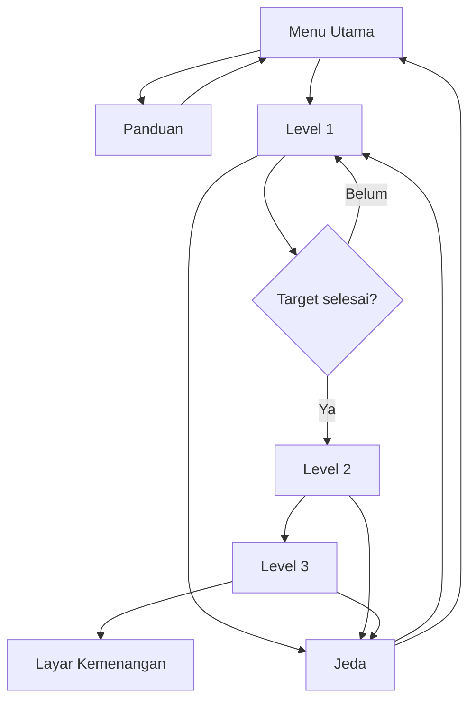

# Forest Quest

Forest Quest adalah contoh game 2D berbasis browser untuk materi Pertemuan 3 mata kuliah **Pengembangan Aplikasi Game (STI7356)**. Proyek ini menunjukkan hubungan antara alur navigasi gameplay, asset game, dan progresi level.

## Capaian Pembelajaran

Setelah mempelajari proyek ini, mahasiswa dapat:

- mengidentifikasi alur navigasi menu dan gameplay;
- menjelaskan core gameplay loop;
- mengelompokkan asset berdasarkan fungsinya;
- menjelaskan peningkatan tantangan antarleveI;
- mengembangkan prototype game 2D sederhana.

## Gameplay

Core loop Forest Quest:

1. menjelajahi level;
2. mengumpulkan sumber daya;
3. menghindari atau menyerang musuh;
4. menyelesaikan target;
5. memasuki portal;
6. membuka level berikutnya.

### Kontrol

| Tombol | Fungsi |
|---|---|
| WASD atau tombol panah | Menggerakkan karakter |
| Spasi | Menembakkan energi |
| P | Menjeda atau melanjutkan permainan |

Game juga menyediakan kontrol sentuh untuk perangkat seluler.

## Struktur Level

| Level | Tujuan pembelajaran | Target permainan |
|---|---|---|
| Rimbun Awal | Pengenalan eksplorasi dan koleksi | Kumpulkan 5 herbal dan kalahkan 2 musuh |
| Desa Sunyi | Kombinasi rintangan dan pertarungan | Kumpulkan 6 perbekalan dan kalahkan 4 musuh |
| Gerbang Purba | Penguasaan seluruh mekanik | Kumpulkan 7 kristal dan kalahkan 6 musuh |

## Asset yang Digunakan

Proyek menggunakan asset yang digambar langsung melalui Canvas API agar mahasiswa dapat mempelajari logika permainan tanpa mengunduh pustaka eksternal.

- karakter pemain;
- musuh bayangan;
- sumber daya;
- rintangan lingkungan;
- portal;
- partikel visual;
- HUD dan menu;
- efek suara sintetis melalui Web Audio API.

## Alur Navigasi



## Menjalankan Proyek

Tidak ada proses instalasi atau build.

1. Unduh atau clone repositori.
2. Buka `index.html` pada browser modern.

Untuk server lokal:

```bash
python3 -m http.server 8000
```

Kemudian buka `http://localhost:8000`.

## Struktur Proyek

```text
.
├── index.html     # Struktur halaman, HUD, menu, dan kontrol
├── styles.css     # Tampilan responsif
├── game.js        # Gameplay, asset Canvas, musuh, level, dan audio
├── LICENSE
└── README.md
```

## Ide Pengembangan Mahasiswa

- menambahkan item pemulih energi;
- mengganti asset Canvas dengan sprite PNG;
- menambahkan NPC dan dialog;
- membuat sistem skor dan waktu;
- membuat level baru;
- menyimpan progres menggunakan `localStorage`;
- menambahkan boss pada level terakhir.

## Lisensi

Proyek ini menggunakan lisensi MIT dan dapat dimodifikasi untuk kegiatan pembelajaran.
